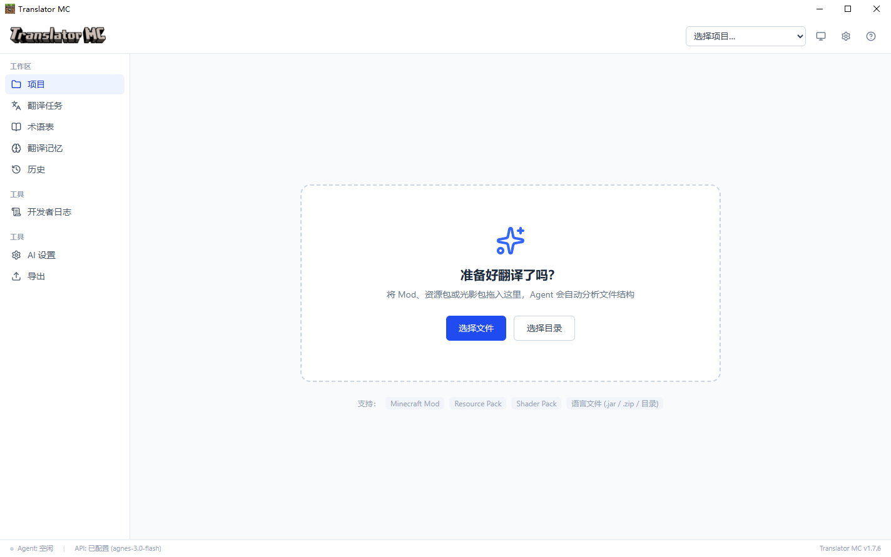
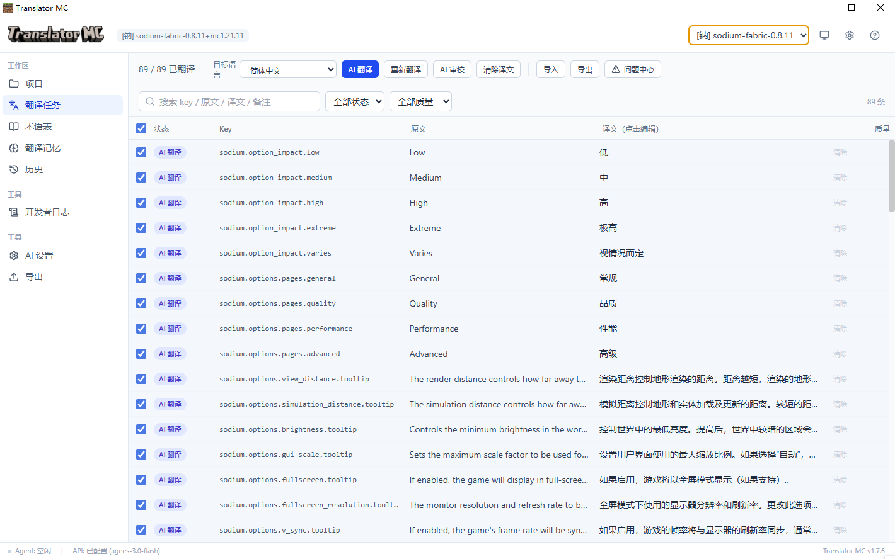
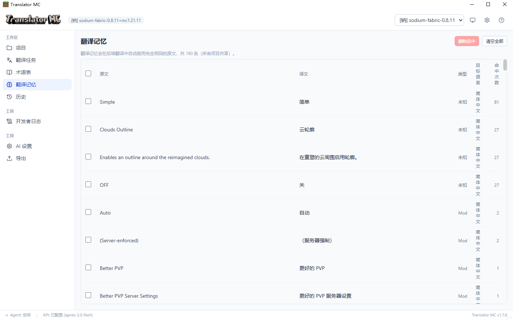
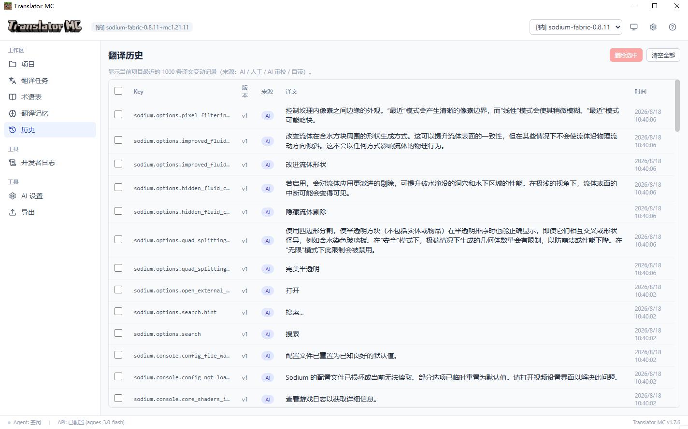

简体中文|[English](README.EN.md)

# Translator MC

Minecraft AI 翻译工具 —— 支持对 `Minecraft Mod` / `Resource Pack` / `Shader Pack` 进行AI翻译，Agent 自动分析文件结构、提取文本、调用大模型批量翻译、术语管理、质量检查、人工审核，最后安全导出。

## 软件特色
 - **界面简洁，新手友好**
 - **多语言支持**
 - **Mod、资源包、光影包支持**
 - **AI精翻**
 - **支持自定义翻译模型**
 - **完全免费开源**

## 软件截图
**主界面：**


**翻译界面：**


**翻译记忆：**


**翻译历史：**



## 运行方法

### 方式一：直接运行打包好的程序（推荐）

1. 在“发行版”下载最新版本二进制文件，

| 文件名                                | 文件类型   |
|------------------------------------|--------|
| `Translator-MC-mobile-win-版本号.zip` | 免安装版   |
| `Translator-MC-Setup-win-版本号.exe`  | exe安装包 |

> 为保证使用体验，请下载使用最新版本应用

### 方式二：开发模式运行（需要 Node.js 20+）

```bash
npm install        # 首次安装依赖
npm run dev        # 启动开发模式（热更新）
```

### 方式三：自己重新打包

```bash
npm run build:win  # 构建 + 打包 Windows 安装程序（输出到 release/）
```

## 核心功能

### 导入与识别

- **拖拽导入**：支持 `.jar` / `.zip` / 目录，可多文件导入。
- **类型识别**：识别 Mod、资源包、光影包。
  - Mod：`fabric.mod.json` / `quilt` / `mods.toml` / `mcmod.info`
  - 资源包：`pack.mcmeta`
  - 光影包：`shaders/`
- **语言文件解析**：适配 `JSON` / `JSON5` / `.lang` / `.properties` / `YAML` / `TOML` 多种解析器。

### 翻译与 AI

- **源语言适配**：自动识别日语、韩语、德语、法语、俄语等非英语源语言。
- **目标语言选择**：支持 12 种目标语言，包括简中、繁中、日、韩、英、法、德、俄、西、葡、意等。
- **AI 批量翻译**：多条一批，支持 OpenAI 兼容 API。
- **多 Provider**：内置 OpenAl、DeepSeek、智谱GLM、Moonshot (Kimi)、本地Ollama、LM Studio 的提供商预设。
- **专用 Prompt**：Mod / Shader / Resource Pack 三套独立系统提示词。
- **上下文翻译**：注入包名、分类、术语表、翻译记忆。
- **翻译记忆**：完全相同的原文自动复用。

### 质量控制

- **术语表**：支持增删改查，注入 Prompt，并进行术语一致性校验。
- **翻译历史**：每次 AI 或人工修改都会记录版本。
- **占位符校验**：校验 `%s` / `%1$s` / `%d` / `${name}` / `<player>` 等占位符。
- **格式代码保护**：保护 `§a` / `§b` / `§r` 等格式代码。
- **JSON Schema 校验**：对 LLM 输出 JSON 进行修复与解析。
- **AI 质量审校**：提供评分、问题、建议。
- **问题中心**：汇总占位符、术语、格式、缺失等问题。

### 导出

- 支持导出汉化资源包 zip，以及修改后的 Jar 文件。

### 界面与效率

- 支持搜索、筛选、批量选择。
- 支持主题切换、快捷键、日志查看。
## 测试

```bash
npm run typecheck                 # TypeScript 类型检查
node scripts/selftest.cjs         # 核心逻辑自测（需先 npx esbuild 打包）
npx electron . --selftest         # 全流程端到端自测（导入→识别→提取→入库→导出）
```

